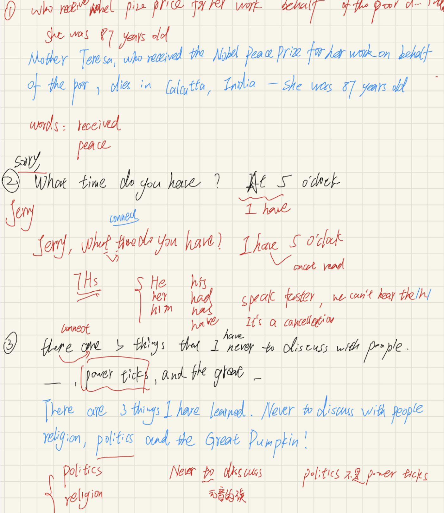
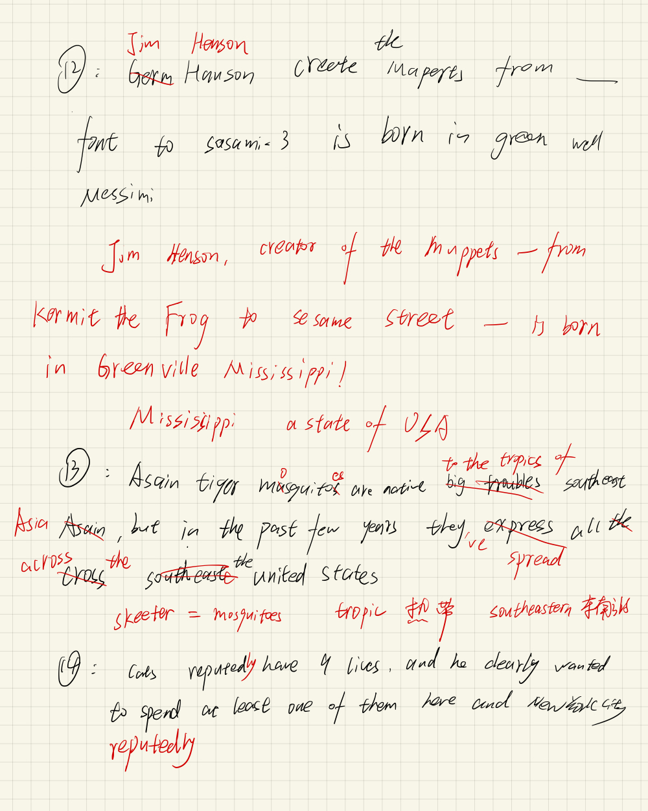
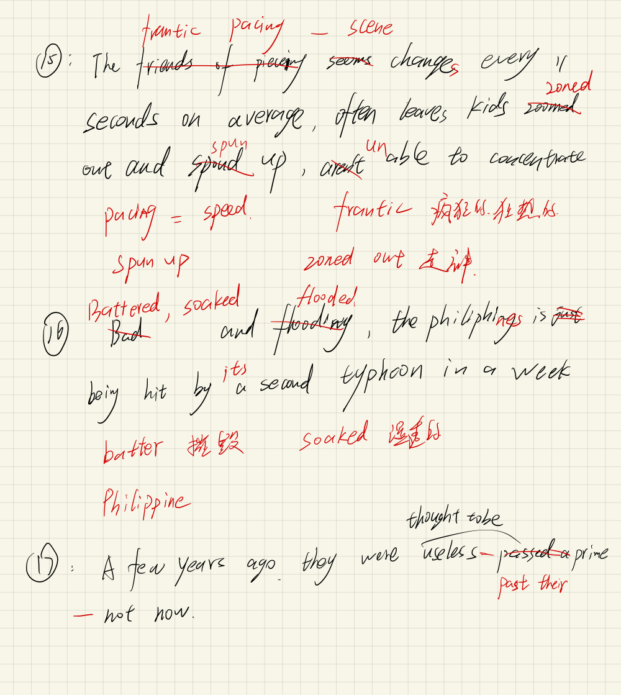
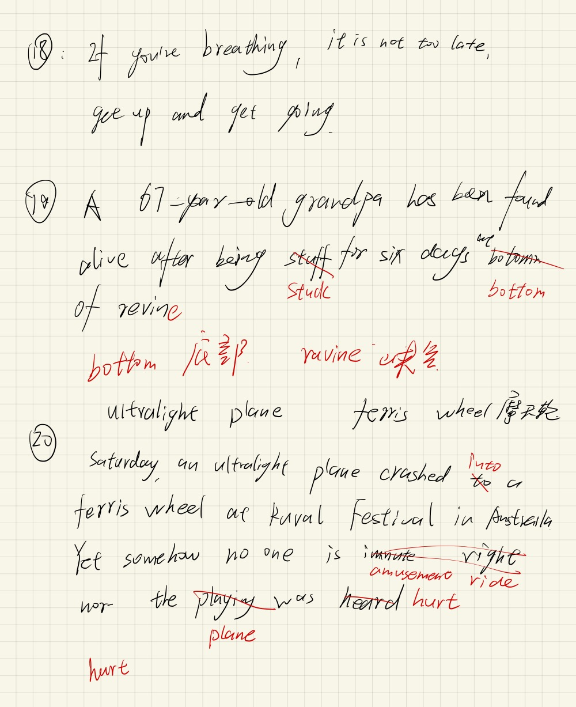
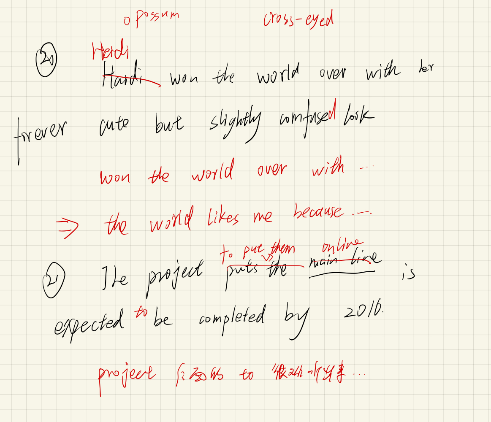
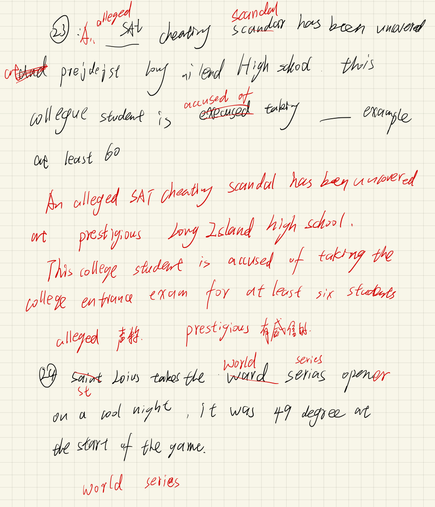
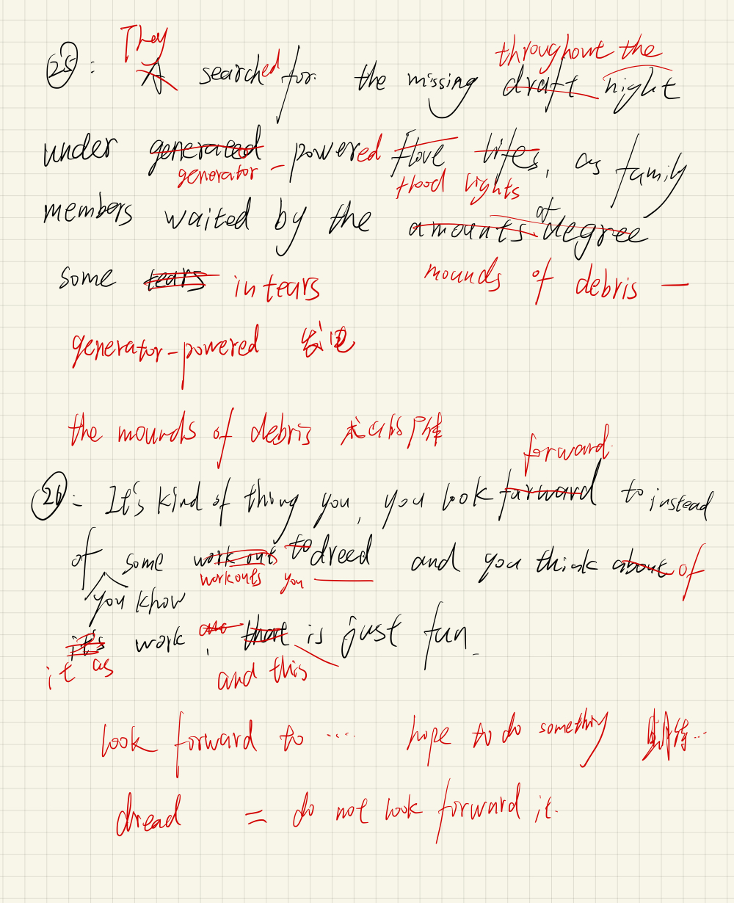

# 英语残酷共学第 1 期残酷指引

> ⚠️ 正式开始前请确保你在身体上和精神上都处于合适的状态，请刻意练习，残酷面对 🆒。

> ⚠️ 记得完成每日学习证明后，去 README.MD 文档最下面的「英语残酷共学记录表」更新自己的每日证明 ✅。如果请假请标记 ⭕️ ，如果未请假被助教检查没有完成学习证明，将被标记 ❌ 失败。

> 为方便检索 The First English Intensive CoLearning 简写为 EICL1st，第 2 期即为 EICL2nd，第 3 期即为 EICL3rd，以此类推。

- [**A-Programmers-Guide-to-English**](https://github.com/yujiangshui/A-Programmers-Guide-to-English) 重新认识英语这门语言 ❤️ 预计 1 天
- [**从 0 开始学习英语语法**](https://hzpt-inet-club.github.io/english-note/) 构成英语的基石：语法 ❤️ 预计 1 天
- [**每日英语听写 Daily English Dictation 1-400**](https://www.bilibili.com/video/BV1U7411a7xG?p=3&vd_source=bc0666711d2280c24d54945ab9c11146) 「听写」对于「听和说」是最有效的方式 ❤️ 预计 18 天，进度是每天至少 2-5 节，每次听写尽量写出来具体的内容，可以总结生词/概述所学/复盘
- ❤️ 最后 1 天复盘总结。

---

# [Junhua]
Hello everyone，My name is Junhua. I am a software development engineer specializing in back-end development and blockchain develop. I want to improve my English listening and speaking skills. 

## Do you think you will finish the whole CoLearning program?
Yes 100%

## Notes
### 2024.6.24
语法之前花时间学过，所以就打算先跳过了，直接开始听写了，3节内容。今天时间有点紧，后面尽量将手写笔记整理好，方便日后学习。

### 2024.6.25
xxx

### 2024.6.26
听写进度4,5,6 今天听写感觉还算比较简单。还是有常用的发音规则没听出来

### 2024.6.27
听写进度7,8,9 

### 2024.6.28
听写进度10, 11

### 2024.6.30
听写进度12, 13, 14

### 2024.7.1
听写进度15, 16, 17

### 2024.7.3
听写进度18, 19, 20

### 2024.7.4
听写进度21, 22

### 2024.7.5
听写进度23, 24

### 2024.7.6
听写进度25, 26

### 2024.7.7
听写进度27, 28, 29

听写笔记的方法和演示，以 https://www.bilibili.com/video/BV1U7411a7xG 为例，仅参考：

1. 不看字幕，听写发音内容，不会的没关系，尽量写即可
2. 反复听几遍，然后继续把内容进行完善，直到无法继续写出来

Mother terisa, who received a noble pice prize from her work on behalf of the pool of india 87 years old.

反复几遍直到听不出：Mother terisa, who received a Noble Pace Prize from her work on behalf of poor and dies of dia cacke in India, she was 87 years old.

3. 到第二天或者查看答案，进行对比和完善总结，把不会的单词进行记录，跟读句子进行训练。

第二节答案：Mother Teresa, who received a Nobel Peace Prize for her work on behalf of the poor, dies in Calcutta India. She was 87 years old.

笔记：

- Teresa：人名，死记硬背
- Nobel Peace Prize：诺贝尔和平奖。Pace 的发音跟 Peace 有区别，Pace 是步伐、速度的意思。
- Calcutta：加尔各答，死记硬背
